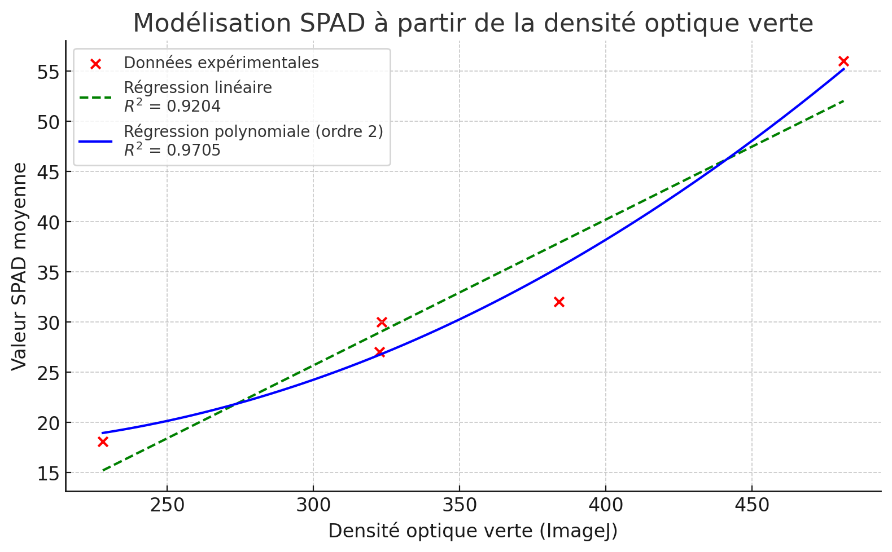

# 🌿 Lyra Leaf SPAD Calibration

> 📛 **Projet Lyra** – Science participative augmentée • 🌱 Écologie reproductible • 🧠 Calibration IA • 🧪 ImageJ + Scanner • 📷 SPAD sans capteur propriétaire

## 🌿 Purpose
This project demonstrates a fully operational, low-cost, and reproducible method to estimate chlorophyll content (SPAD-like values) from scanned leaf images. The approach combines:

- A flatbed scanner
- ImageJ (Fiji)
- Manual SPAD measurements (SPAD-502 Minolta)
- A RGB calibration chart used to validate digital optical density over time
- Statistical modelling (regression)

The goal is to democratize plant physiological diagnostics using only free tools and common devices, without dependence on proprietary sensors.

---

## 🧭 Methodology (Full Chronology)

### 1. Visual Calibration Chart Assessment
- A Kodak-style RGB chart printed in 2009 was recovered.
- The vertical green scale (from 0 to 100) was visually intact and contrast-rich.
- A visual inspection in daylight confirmed no apparent fading.
- A detailed scan at 600 dpi PNG was used to assess channel integrity.

### 2. Validation of Color Stability Over Time
- The RGB chart was rescanned.
- 10 patches (10 to 100) were extracted.
- Pixel intensity values from the green channel were analyzed using Python.
- A very linear degradation was confirmed from patch 10 to 100.
- Special attention was given to the final two patches (90–100): the scanner clearly captured a 5-point difference in G values, undetectable to the human eye.

### 3. Historical Comparison with 2009 Densitometer Data
- In 2009, density measurements were taken on the same chart using a yellow-channel densitometer.
- These values were plotted and compared to the scanner’s green channel in 2025.
- After normalization, the two curves were nearly identical (R² ≈ 0.99).
- This confirmed that the scanner is a viable substitute for field-level optical density calibration.

### 4. ImageJ and Excel Manual Validation
- The RGB image was converted to grayscale.
- Each patch was analyzed manually using ImageJ (`freehand selections` + `Measure`).
- The data were exported to Excel.
- A second-order polynomial fit was performed.
- The curve confirmed the linearity and sensitivity of the grayscale across the green scale.

---

## 🍋 In Vivo Leaf Experiment (Citronnier)

### 🟢 Sampling
- 5 leaves were collected from a single lemon tree in pot (various stages: healthy, maturing, chlorotic).
- Each was scanned alongside its SPAD measurement written manually.
- 3 to 6 SPAD readings per leaf were averaged.

### 🔬 Measurement
- Each leaf was analyzed using ImageJ with calibrated Image → green DO.
- ROIs were drawn manually to match leaf areas.

### 📊 Dataset Collected
| DO vert (ImageJ) | SPAD (mean) |
|------------------|-------------|
| 227.9            | 18.1        |
| 322.5            | 27.0        |
| 384.0            | 32.0        |
| 323.3            | 30.0        |
| 481.4            | 56.0        |

### 📈 Resulting Model
- Polynomial regression (2nd order): R² = 0.9705
- The model accurately captures the non-linearity of chlorophyll saturation
- Allows extrapolation from DO → SPAD across the typical range 15–60

---

## 🖼️ Result



This plot shows the regression fit obtained from five leaf samples scanned and measured. Despite the limited number of points, the model captures the physiological behavior of chlorophyll concentration: slow rise at low DO, rapid increase in the mid-range, and saturation beyond DO ~450. This curve will be used to simulate additional synthetic data for Lyra_Leaf training.

---

## 🤖 Integration in Lyra Ecosystem
- This protocol is compatible with Lyra_Leaf and science participative AI pipelines.
- It enables training of GPT-based models from structured SPAD-DO pairs.
- The approach is low-cost, reproducible, transparent, and sensor-independent.

---

## 📂 Repository structure
```text
/calibration/
├── calibration mire ImageJ Jérôme
├── calibration ImageJ
├── comparaison densitomètre scanner
├── corrélation gris vert ImageJ
├── mire densité gris
├── mire Kodack 100 dpi
├── gradation RVB sur la mire

/data/
├── citronnier couleur
├── citronnier greyscale

/result/
├── SPAD DO Vert
├── Modèle_SPAD_DO_verte

/docs_fr/
├── Validation scanner et mire_Fr
├── README_Fr
```

---

## 🧠 Key Takeaways
- A 15-year-old RGB chart can still serve for optical calibration
- Flatbed scanners provide sufficient resolution and fidelity to detect differences undetectable by eye
- Manual ImageJ analysis is consistent with Python automation
- SPAD-like diagnostics are possible with zero proprietary tools

This repository demonstrates the scientific validity of **participative ecological diagnostics** and opens the door for **low-cost chlorophyll tracking**, ready for future AI and field integration.

---

🔗 **Related project**:  

- [Lyra_LowCost_Soil_Leaf](https://github.com/Jerome-openclassroom/Lyra_LowCost_Soil_Leaf) – Integrated low-cost soil and leaf model for terrestrial primary productivity.
- [TurbiditySensor_OpenScience](https://github.com/Jerome-openclassroom/TurbiditySensor_OpenScience) – Optical-based estimation of aquatic turbidity and primary productivity using open-source sensors.
- [Leaf_Chlorose_CNN_Training](https://github.com/Jerome-openclassroom/Leaf_Chlorose_CNN_Training) – CNN-based classification of chlorotic vs. healthy leaves from scanned images.
- [Lyra_DO_Green_Mesurim](https://github.com/Jerome-openclassroom/Lyra_DO_Green_Mesurim) - A low-tech protocol combining MesurimPro and ImageJ to estimate chlorophyll levels from scanned leaves, with validation against SPAD readings and AI-assisted correlation analysis.
- [AI_Assisted_Lake_Ecology](https://github.com/Jerome-openclassroom/AI_Assisted_Lake_Ecology) – A full-scale NPP model combining field measurements, physical modeling, and GPT-4o-assisted ecological interpretation. Includes empirical correction for realistic annual productivity in clear lakes.
- [LimonTree_NPP_Model](https://github.com/Jerome-openclassroom/LimonTree_NPP_Model) — Low-cost water and NPP model for a potted lemon tree.
- [Mountain_Bocage_Soil_Analysis](https://github.com/Jerome-openclassroom/Mountain_Bocage_Soil_Analysis) — Complete soil dataset for a mid-mountain bocage site (Haute-Loire, France): texture, CEC, pH, nitrates, structural stability, and Berlèse funnel microfauna extraction. Ready for AI-assisted ecological modeling.
- [Lyra_Sentinel_MODIS_Site_HauteLoire](https://github.com/Jerome-openclassroom/Lyra_Sentinel_MODIS_Site_HauteLoire) — Combined Sentinel-2 NDVI and MODIS LST for a semi-natural site in Haute-Loire (France): ROI clipping, clean map, and reproducible notebook. Ready for AI-assisted ecological modeling.
- [Eco_Profile_Saint_Julien_1060](https://github.com/Jerome-openclassroom/eco-profile-saint-julien-1060) — 1-ha eco-climatological site (1060 m, Massif Central) with 2017–2018 records and multi-disciplinary field data.


---

© Jérôme-X1, 2025
